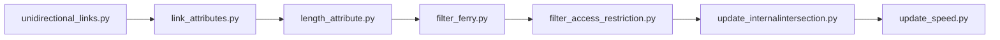

# mobiliti-network

This repository contains the scripts to convert Here Map to Mobiliti Map. The following is the order in which these steps are executed. 

After executing the aforementioned pipeline, a fully processed California network is generated, which can subsequently be clipped according to the specified region of interest.

