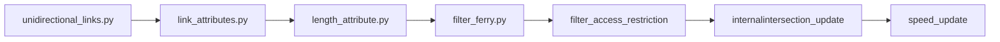

# mobiliti-network

This repository enumerates the procedures undertaken to convert Here Map to Mobiliti Map. 

After executing the aforementioned pipeline, a fully processed California network is generated, which can subsequently be clipped according to the specified region of interest.

