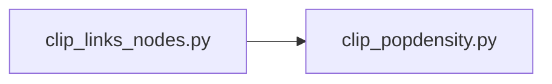

Once the main pipeline is executed and the fully processed California network is written, the next step involves running the scripts to clip the links and nodes to the specified region of the demand model TAZ boundary. To generate the population density, it is necessary to download the GHS human settlement raster file.

To proceed, ensure that the paths for all the required files are specified in the config.yaml file. Once done, execute the below scripts.

