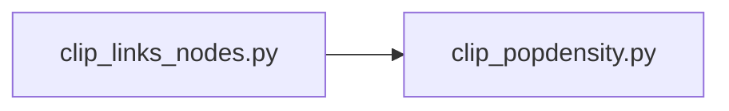
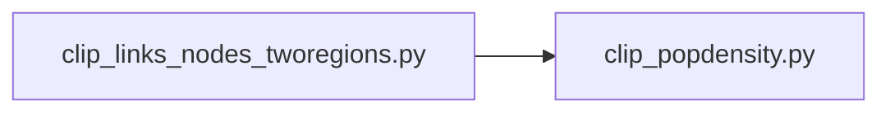

Once the main pipeline is executed and the fully processed California network is written, the next step involves running the scripts to clip the links and nodes to the specified region of the demand model TAZ boundary. To generate the population density, it is necessary to download the GHS human settlement raster file.

To proceed, ensure that the paths are chnaged to the region of interest in the config.yaml file. After that,  execute the below scripts. To process the population density, the raster for teh area shoudl be downloaded from from https://ghsl.jrc.ec.europa.eu/download.php?ds=pop with the following specification. 
epoch = 2020, CRS = WGS84, resolution = 3arcsec

For clipping networks with 2 regions combined, for example, SanDiego and SACOG together, execute the following scripts. This can easily be modified for more than two regions if needed. 

